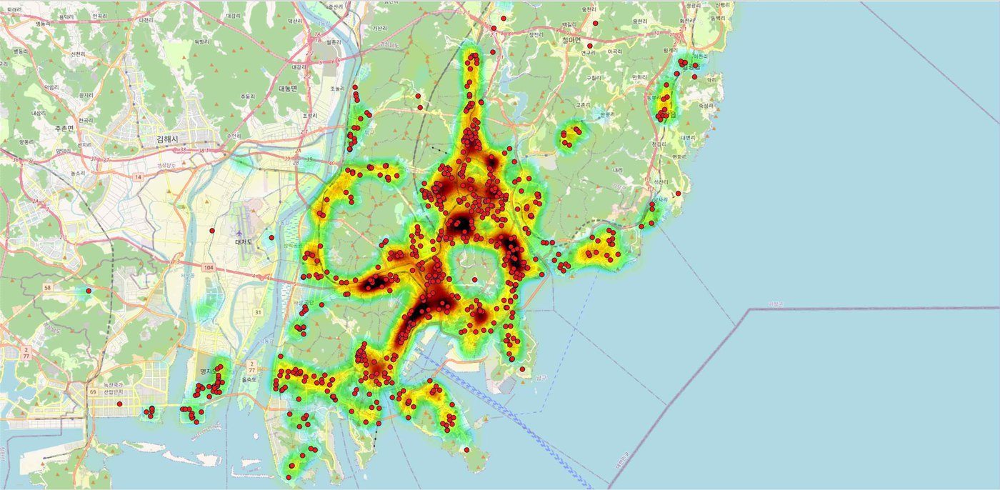
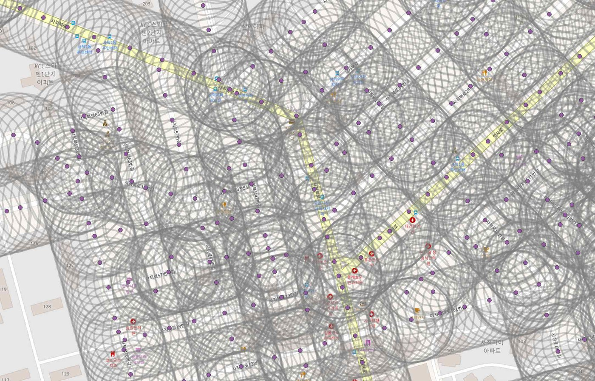
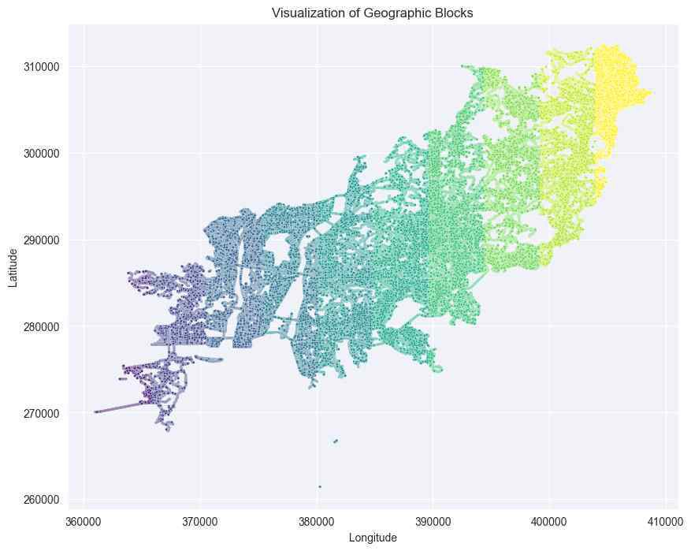
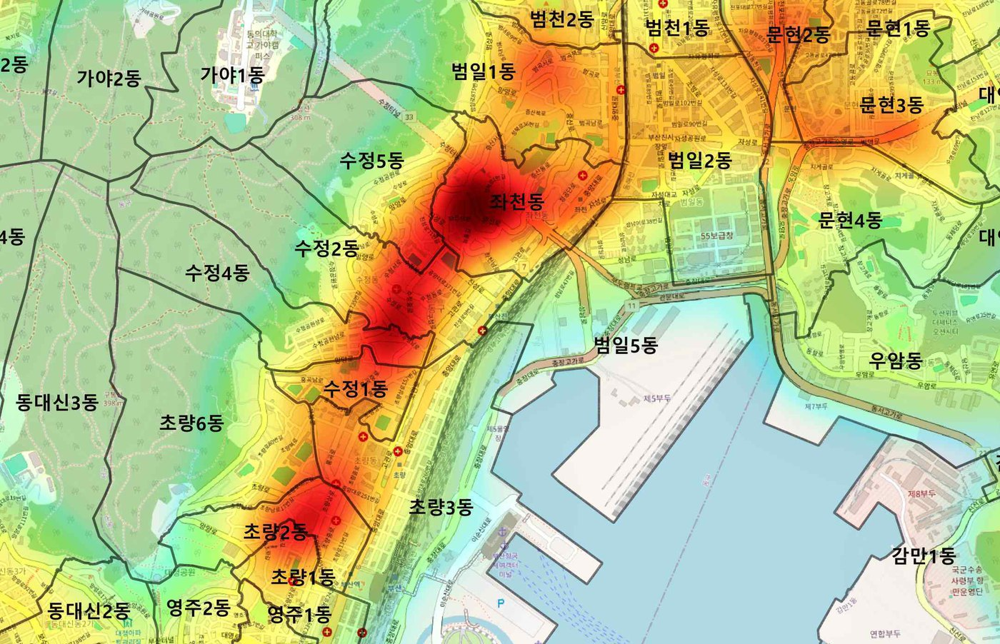
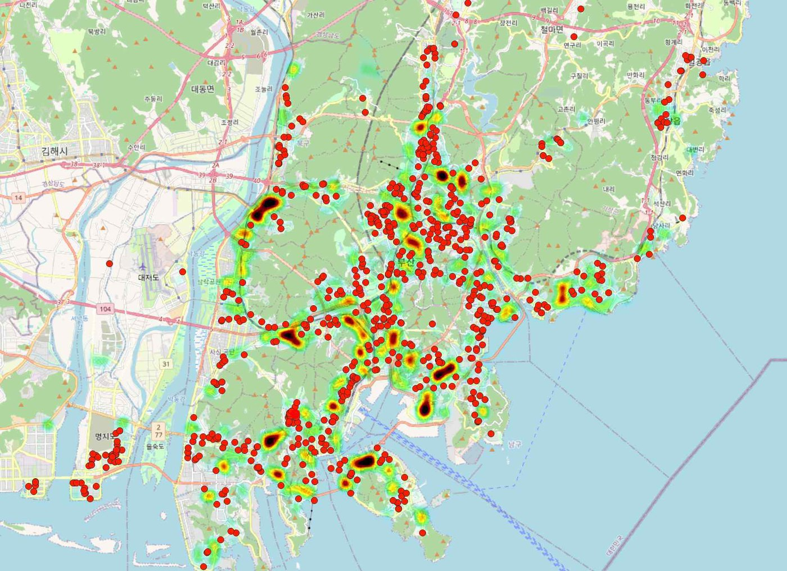
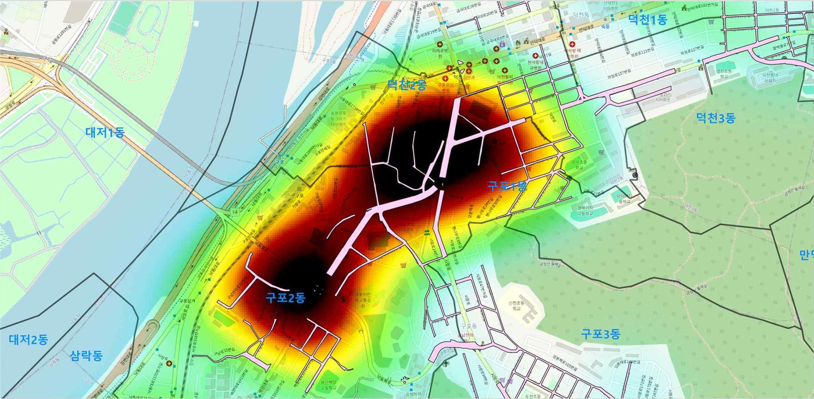
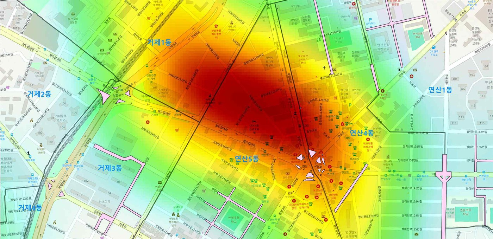

# 사각지대를 예측하다
### 예측 모델이 밝혀낸 부산 어린이 보호구역의 공백

**2025 Big Data 활용 대회 · 빅데이터 분석 부문 최우수상 (부산광역시장상)**

 

> **English summary** — Child pedestrian accidents in Korea happen mostly *outside* designated school zones (≈94% per TAAS). We split Busan's road network into **points every 30 m**, built **32 spatial features** (child population, child facilities, road environment, land use, slope) with dual 300 m / 50 m buffers in QGIS, and trained an **XGBoost** classifier validated with **geographic block cross-validation** (StratifiedGroupKFold, 10 blocks). Each point is labelled `is_accident` = 1 if a child-pedestrian accident (TAAS, 2020–2024) occurred within 300 m of it; after dropping the 34 points with no slope value, **61,848 of 240,064 points** are positive. With a recall-first threshold of 0.45 the model reaches **recall 0.87** on accident areas (accuracy 83%). We reinterpret **false positives as "policy blind spots"**: high-risk roads that are not (yet) protected, checked with field surveys. Won the **Top Excellence Award (Mayor of Busan Award)** in the Big Data Analysis Division of the 2025 Big Data Utilization Contest.

---

## 목차
1. [한눈에 보기](#1-한눈에-보기)
2. [문제 정의](#2-문제-정의)
3. [데이터](#3-데이터)
4. [분석 방법](#4-분석-방법)
5. [결과](#5-결과)
6. [정책 제안](#6-정책-제안)
7. [한계와 다음 단계](#7-한계와-다음-단계)
8. [나의 역할](#8-나의-역할)
9. [산출물](#9-산출물)

---

## 1. 한눈에 보기

| 항목 | 내용 |
|---|---|
| 질문 | 부산에서 **아이들이 실제로 다치는 도로**는 어디이며, 그중 **보호구역으로 지정되지 않은 곳**은 어디인가? |
| 분석 단위 | 도로중심선 위 30m 간격 지점 **240,064개** |
| 피처 | 4개 범주 **32개** (어린이 유동인구 4 · 어린이 시설 9 · 교통환경 14 · 토지특성 5) |
| 모델 | XGBoost 이진분류 + `scale_pos_weight` + Grid Search |
| 검증 | 공간 블록 교차검증 (`StratifiedGroupKFold`, 10개 지리 블록) · Out-of-Fold 예측 |
| 핵심 결과 | 사고 지역 **재현율 0.87**, 정확도 83% · 위양성 지역을 **정책 사각지대**로 해석 |
| 검증 | 장전동·사직동·구포동·감만동·연산동 **현장답사** |

## 2. 문제 정의

- 한국의 인구 10만 명당 도로교통 사망자는 5.0명이고, 사망자 중 보행자 비율은 35.2%로 OECD 평균을 크게 웃돈다 (ITF, 2022).
- 2020년 '민식이법' 시행 이후 **보호구역 안** 어린이 사망사고는 연 2~3명 수준으로 줄었다.
- 그러나 어린이 교통사고의 **약 94.2%는 보호구역 밖**에서 발생한다 (한국도로교통공단 TAAS). 학교 중심의 보호구역은 학원·놀이터·편의점으로 이어지는 아이들의 실제 동선을 담지 못한다.
- 선행연구는 대부분 서울·수도권에 집중되어 있다. 부산은 **경사가 급한 산지 지형**, 구도심과 신도시가 섞인 **복잡한 도로 구조**, 주거·상업이 뒤섞인 **고밀도 시설 분포**를 가져 다른 모델이 필요하다.

**목표:** 부산의 지형·도로·토지이용 특성을 정량 변수로 넣은 예측 모델로 사고 위험 지역을 찾고, 보호구역 지정의 빈틈을 데이터로 보여준다.

## 3. 데이터

| 데이터 | 형식 | 기간 | 출처 |
|---|---|---|---|
| 부산시 어린이집 | xlsx | ~2025.05.31 | [어린이집 정보공개포털](https://info.childcare.go.kr/) |
| 부산시 유치원 · 초등학교 | xlsx | ~2025.03 | [부산광역시교육청](https://www.pen.go.kr/) |
| 부산시 학원 및 교습소 | xlsx | ~2025.04.14 | [부산 Big-데이터웨이브](https://data.busan.go.kr/) |
| 횡단보도 · 신호등 · 버스정류장 | csv/shp | 2024~2025 | [부산 Big-데이터웨이브](https://data.busan.go.kr/) |
| 행정동별 성·연령별 생활인구 (0–14세) | csv | 2020.01–2024.12 | 부산 데이터 오픈랩 |
| 도시지역 (용도지역) | shp | 2025.06 | [V-World 디지털트윈국토](https://www.vworld.kr/) |
| 등고선 · 도로중심선 · 인도 · 교차로 · 지하철역 · 어린이 보호구역 | shp | 연속수치지형도(2023) | [국토정보플랫폼](https://map.ngii.go.kr/) |
| 어린이 보행자 교통사고 위치 | 좌표 | 2020–2024 | [TAAS 교통사고분석시스템](https://taas.koroad.or.kr/) (지도에서 좌표 수동 취득) |

> 원본 데이터는 각 기관의 이용 조건에 따라 이 저장소에 포함하지 않았습니다.

## 4. 분석 방법

<table>
<tr>
<td width="50%"></td>
<td width="50%"></td>
</tr>
<tr>
<td align="center">그림 1. 30m 간격 도로 지점과 분석 버퍼</td>
<td align="center">그림 2. 공간 교차검증을 위한 10개 지리 블록</td>
</tr>
</table>

**4-1. 분석 단위 — 왜 30m인가.** 서울시 보행 사고의 L-function·KDE 분석(황정현·고준호, 2024)에서 사고 군집이 가장 뚜렷한 최소 거리가 30~35m였다. 이 결과를 따라 도로망 위 30m마다 분석 지점을 두었다.

**4-2. 이중 반경 피처.**
- **300m**: 「도로교통법 시행규칙」의 보호구역 지정 범위. 어린이 인구·시설·토지이용 같은 **생활권 변수**를 모은다.
- **50m**: 운전자가 보행자를 보고 피할 수 있는 거리. 신호등·횡단보도·교차로 같은 **교통환경 변수**를 모은다. 학원은 등하교 동선보다 즉시 노출 위험이 크다고 보고 50m를 적용했다.
- **경사도**: 등고선을 TIN 보간해 5×5m DEM을 만들고, QGIS `Slope`로 각 지점의 기울기를 뽑았다. 산지가 많은 부산만의 핵심 변수다.
- **사고 데이터 정제**: 도로와 닿지 않는 사고(아파트 단지·주차장 내부)를 버퍼 교차로 걸러 761건 중 **730건**을 사용했다.

**4-3. 모델.** 변수 간 상관이 높은 고차원 공간 데이터라서 다중공선성과 결측에 강하고 변수 중요도를 볼 수 있는 **XGBoost**를 골랐다. 라벨(`is_accident`)은 지점 반경 300m 안에서 어린이 보행자 사고(TAAS, 2020–2024)가 있었는지 여부다. 피처 테이블(`analysis/data/road_points.gpkg`)의 240,098개 지점 중 경사도 값이 없는 34개를 빼고 **240,064개** 지점을 썼으며, 그중 **61,848개**가 사고 지점이다. 사고 지역이 소수 클래스(25.8%)라서 `scale_pos_weight`를 자동 산출해 적용했다.

| 하이퍼파라미터 | 값 |
|---|---|
| `learning_rate` | 0.1 |
| `max_depth` | 3 |
| `n_estimators` | 100 |
| `subsample` | 0.7 |
| `colsample_bytree` | 0.8 |

**4-4. 공간 교차검증.** 인접한 지점은 서로 닮았기 때문에(공간 자기상관) 무작위 K-Fold는 성능을 부풀린다. 부산을 **10개 지리 블록**으로 나누고 같은 블록은 항상 같은 fold에 넣는 `StratifiedGroupKFold`를 썼다. 모든 지점의 사고 확률은 **Out-of-Fold** 예측값이라 학습 데이터 누수가 없다.

**4-5. 임계값.** 어린이 사고는 한 건만 나도 사회적 비용이 크므로, 놓치는 쪽(위음성)을 줄이기 위해 임계값을 0.5 대신 **0.45**로 낮췄다.

## 5. 결과

**혼동행렬** (240,064개 지점, Out-of-Fold)

| | 실제 무사고 (0) | 실제 사고 (1) |
|---|---:|---:|
| **예측 무사고 (0)** | 145,544 (TN) | 8,171 (FN) |
| **예측 사고 (1)** | 32,672 (FP) | 53,677 (TP) |

| 클래스 | 정밀도 | 재현율 | F1 | 지점 수 |
|---|---:|---:|---:|---:|
| 무사고 (0) | 0.95 | 0.82 | 0.88 | 178,216 |
| **사고 (1)** | 0.62 | **0.87** | 0.72 | 61,848 |

- 실제 사고 지역의 **87%를 포착**했고 전체 정확도는 83%다.
- 사고 지역 정밀도 0.62는 재현율을 우선한 결과다. 모델이 위험하다고 봤지만 아직 사고가 없는 지역, 즉 **위양성 32,672개 지점**을 다음 단계에서 따로 해석했다.

<table>
<tr>
<td width="50%"></td>
<td width="50%"></td>
</tr>
<tr>
<td align="center">그림 3. 좌천동·수정1동·초량2동: 실제 사고 지점과 고위험 예측이 겹침</td>
<td align="center">그림 4. 위양성(사고 없음, 고위험 예측) 지역 분포</td>
</tr>
</table>

**위양성의 재해석 — "오류"가 아니라 "사각지대".** 위양성 지역은 기존 사고 지역 주변이거나, 교통량이 많고 어린이 시설이 밀집한 곳이 대부분이었다. 두 경우를 나눠 봤다.

<table>
<tr>
<td width="50%"></td>
<td width="50%"></td>
</tr>
<tr>
<td align="center">그림 5. 구포동: <b>이미 보호구역</b>인 곳을 모델도 고위험으로 평가 → 지정의 타당성 확인</td>
<td align="center">그림 6. 연산동: 고위험인데 <b>보호구역이 아닌</b> 곳 → 정책 사각지대</td>
</tr>
</table>

- **이미 보호구역인 고위험 지역** (구포동, 감만동): 모델 평가가 기존 지정의 타당성을 뒷받침한다.
- **보호구역이 아닌 고위험 지역** (연산동, 우1동, 문현동 등): 예방적 개입이 부족한 **정책적 사각지대**다.
- 5개 동(장전동·사직동·구포동·감만동·연산동)을 직접 **현장답사**해 도로 구조와 시설 밀집도를 확인했다. 사진은 [발표자료](docs/presentation.pdf) 20–33쪽에 있다.

## 6. 정책 제안

1. **현장조사 우선**: 위양성 지역 중 보호구역이 없는 범일동·우동·연산동부터 어린이 통행량과 주변 시설을 점검해 개입 우선순위를 정한다.
2. **선제적 보호 조치**: 위험도가 높은 구간은 사고 전에 임시 보호구역으로 지정하고 과속방지턱, 횡단보도 개선, 보행자 신호를 먼저 보강한다.
3. **동적 관리 체계**: 위험 지역은 도시 변화에 따라 바뀌므로, 최신 데이터로 모델을 주기적으로 재학습해 보호구역을 갱신한다.
4. 고위험 지역의 **불법 주정차 단속 강화**와 **전문가 동반 현장 점검**을 병행한다.

## 7. 한계와 다음 단계

- **위양성은 가설이다.** 모델의 구조적 오분류일 수도 있으므로 현장조사와 전문가 검토로 확인해야 한다.
- **상관이지 인과가 아니다.** 시설 밀도나 도로 폭이 사고의 직접 원인이라고 해석하면 안 된다.
- **설명력의 한계.** 예측력에 비해 변수 중요도 해석이 어렵다. 다음에는 SHAP로 지점별 위험 요인을 분해하고, 시간대(등하교·학원 시간)별 위험을 따로 모델링해 보고 싶다.

## 8. 나의 역할

4인 팀에서 다음을 맡았다.

- **분석 방향·주제 선정**: "보호구역 밖에서 나는 사고"라는 문제 정의와 분석 방향 설정을 주도
- **데이터 수집·전처리**: 공공데이터 수집, QGIS 공간 매핑, 30m 지점·이중 반경 피처 구축
- **모델링**: XGBoost 학습과 공간 교차검증 설계
- **시각화·발표**: 사고 확률 히트맵 제작, 발표자료 작성

## 9. 산출물

| 파일 | 설명 |
|---|---|
| [`docs/report.pdf`](docs/report.pdf) | 분석 보고서 (11쪽). 참가 신청서는 개인정보가 있어 제외했다. |
| [`docs/presentation.pdf`](docs/presentation.pdf) | 본선 발표자료 (40쪽). 현장답사 사진 포함 |
| [`figures/`](figures/) | 보고서 그림 10장 |
| [`analysis/cpz_xgb.ipynb`](analysis/cpz_xgb.ipynb) | XGBoost 학습과 공간 교차검증 노트북 |
| [`analysis/modeling.ipynb`](analysis/modeling.ipynb) | 같은 도로 지점 데이터로 모델을 확인하는 노트북 |
| [`analysis/data/road_points.gpkg`](analysis/data/road_points.gpkg) | 도로중심선 30m 지점 피처 테이블 |

<b>참고문헌</b>

- 홍지수·문형주 (2023). 서울시 어린이 교통사고 위험지역 예측을 통한 신규 어린이보호구역 지정·운영 방안. *2023 서울 데이터 펠로우십 분석보고서*.
- 황정현·고준호 (2024). L-function과 KDE를 이용한 서울시 보행교통사고 잦은 곳의 공간적 범위 설정과 특성 분석.
- 홍승표 (2023). 위치정보를 활용한 교통사고 발생지역 분석 – 전주시 어린이보호구역을 중심으로.
- 오승지 (2025). 어린이보호구역 내 보행자 교통사고 및 횡단사고 영향요인 분석.
- 고동원·박승훈 (2019). 어린이보호구역 내 발생한 보행자 교통사고에 영향을 미치는 근린환경특성.
- 신지희 (2022). GIS를 활용한 노인 및 어린이 교통사고 다발지역과 노인 및 어린이 보호구역 지정에 대한 적합성 검증.
- 조정윤·황의갑 (2019). GIS를 이용한 전국 교통사고 공간분석.
- 김영웅 (2023). 머신러닝을 활용한 잠재적 위험도로 예측 및 사상자 영향 요인 분석 혼합 앙상블 모형 개발.
- 김영준 (2022). 머신러닝을 활용한 어린이보호구역 내 어린이 교통사고 심각도 요인 분석 연구.
- 이수현 (2022). 머신러닝을 활용한 어린이 스마트 횡단보도 최적입지 선정.
- Kim, H., Jang, J., & Choi, Y. (2022). Spatial analysis of collision risk of child pedestrians – A case of urban elementary school districts in Busan, Korea.
- International Transport Forum (2023). *Road Safety Country Profile Korea 2023*.

---

팀 프로젝트 산출물입니다. 팀원의 개인정보 보호를 위해 이름은 적지 않았습니다. · 문의: [GitHub @Lunecid](https://github.com/Lunecid)
